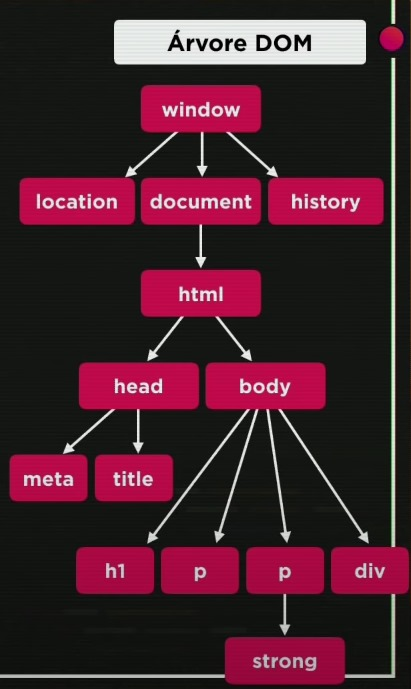

# DOM no javascript

DOM significa Document Object Model

## Tipos de Seleção

* por marca (getElementsByTagName()[])
* por ID (getElementById())
* por Nome (getElementsByName()[])
* por classe (getElementsByClass()[])
* por seletor (querySelector()) (querySelectorAll()) recomendavel

### Por marca

~~~javascript
    var p1 = window.document.getElementsByTagName('p')[0] //vai pegar o primeiro paragrafo do documento
~~~

~~~javascript
    var d1 = window.document.getElementById('msg')//vai pegar o ID da tag
    d1.style.background = 'green'
    d1.innertext = 'Estou aguardando'
~~~

### Por selector (recomendado)

~~~javascript
    var d1 = window.document.querySelector('div#msg')   
~~~